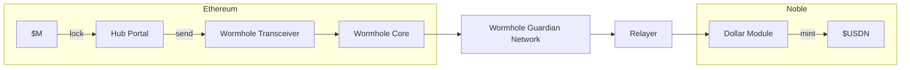

# Architecture

The implementation of USDN is in the [`dollar`](https://github.com/noble-assets/dollar) module.
It handles all core functionality including rebasing mechanics,
cross-chain operations, and vault management.

The module integrates with external bridging protocols like Wormhole, IBC, and Hyperlane
to enable USDN transfers while preserving rewards-bearing properties across different networks.

 ```mermaid
  flowchart TB
    %% Top source
    M0[M0]

    %% x/dollar module
    subgraph CORE ["x/dollar"]
      IDX[Index Update]
      UPS[Update Supply]
      MINT[Mint Yield]
      PRINCIPAL[("Principal")]
      STATS[("Statistics")]

      IDX --> UPS
      UPS -->|yield = Δ supply| MINT
    end

    %% Connections into core
    M0 --> IDX

    %% Distribution
    MINT --> YDE[Yield Distribution Engine]
    YDE --> USER[User Wallets]

    %% Cross-chain section
    subgraph CCY ["Cross-Chain Yield"]
      IBC[IBC]
      HYP[Hyperlane]
    end
    YDE --> CCY
    CCY --> ETH[Ethereum]
    CCY --> ARB[Arbitrum]
    CCY --> COS[Cosmos Chains]

    %% User action back to core
    USER --> |MsgClaimYield| CORE
  ```

## Rebasing Mechanism

The so-called `Index` is used to keep track of the yield accrued by USDN, which is minted on Noble.
It starts at `1.0` and increases as rewards accrue, allowing all balances to grow proportionally.

For each address, the protocol tracks two key values:
- **Principal Amount**: The fixed underlying amount (never changes)
- **Present Amount**: What users see in their wallet (grows with rewards)

The rewards distribution flow works as follows:

1. **Index Update**: Noble periodically receives an updated index from M0
2. **Supply Calculation**: New expected supply = `Total Principal × New Index`
3. **Token Minting**: Difference between expected and current supply gets minted
4. **Rewards Distribution**: New tokens flow to the rewards module account, then:
   <!-- TODO: we should eventually add a user flow page for this and show how to do it, would be helpful IMO -->
   - **Users on Noble**: Must manually claim their rewards.
   - **Cross-chain recipients**: Rewards are automatically sent every ~2 hours via configured IBC/Hyperlane routes when index updates occur.

### Rewards Distribution Example

The following is a given example distribution flow, which describes the process of rebasing as it is explained above.

**Initial State:**
- User holds: **1,000 USDN**
- User's principal: **1,000** (underlying ownership)
- Current index: **1,000,000,000,000**

**After 5% Treasury Rewards:**
- New index: **1,050,000,000,000** (5% increase)
- New balance = `Principal * (New Index / Old Index)`
- New balance = `1,000 * 1.05 = 1,050 USDN`
- User automatically earns: **50 USDN** (5% rewards)

This 5% index increase makes 5% additional balance claimable per user based on their principal and the new index; balances update upon claim.

## Cross-Chain Operations

USDN enables cross-chain yield streaming functionality in a manner that preserves the token's yield-bearing properties across different blockchain networks.

Both \$M principal and the accrued yield are bridged to Noble from Ethereum via Wormhole's Native Token Transfer (NTT) through M0's [M Portal](https://docs.m0.org/home/technical-documentations/m-portal/overview/). This bridging mechanism locks the original \$M tokens on Ethereum and sends the equivalent value to Noble.



Once the bridged \$M arrives on Noble, it is minted as USDN with the same rebasing properties as the original \$M token.

From Noble, USDN can be further distributed to other blockchain networks via two primary bridging protocols. **IBC (Inter-Blockchain Communication)** enables USDN transfers to Cosmos SDK chains over IBC channels, while **Hyperlane** facilitates movement to EVM-compatible chains.

## Key Formulas

The supply of USDN $S$ depends on the held principal $P$ and the mentioned index $I$.

```math
S = \sum{P} * I
```

When the index is updated, a new total supply is calculated and
the difference between the old and new supply is paid out as yield.
This yield is making up the sum of the individual claimable yields $Y_i$.

```math
Y_t = S_t - S_{t-1} = \sum_{i}{Y_{i,t}}
```


When a user claims, the balance of the account $B_i$ increases by the designated yield portion.

```math
B_{i,t} = Y_{i,t} + B_{i,t-1}
```
