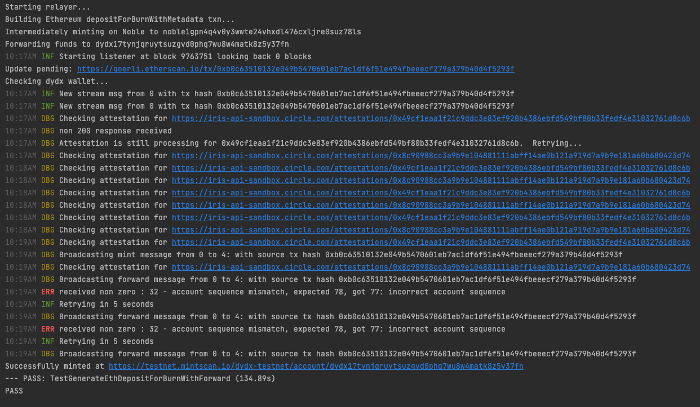

# CCTP Receive + IBC Forward

## Flow

- User calls smart contract to burn the tokens on the source chain (Ethereum, Avalanche, Optimism, Arbitrum, etc.), including IBC forwarding instructions.
- CCTP relayer observes finalized burn and requests Attestation from Circle Iris API
- Circle Iris API proves burn with metadata and issues attestations
- CCTP relayer broadcasts the messages and attestations to Noble
- Noble processes the CCTP BurnMessage and mints the token
- Noble processes the CCPT IBC forward metadata message and forwards the token to the destination chain

## Deposit For Burn

Similar to Circle's [original function][Original Deposit For Burn], the wrapper contract includes four new function parameters, which are highlighted below.

```solidity {2,3,4,8}
function depositForBurn(
    uint64 channel,
    bytes32 destinationBech32Prefix,
    bytes32 destinationRecipient,
    uint256 amount,
    bytes32 mintRecipient,
    address burnToken,
    bytes calldata memo
) external returns (uint64 nonce)
```

Let's expand on what each of these parameters means:

### `channel`

This parameter defines the [IBC Channel] to use when forwarding your newly minted $USDC.

You can find a list of trusted channels [here][Mainnet Relayers] (for testnet, [here][Testnet Relayers]).

:::tip

  In the case of the dYdX Testnet, this would be [`channel-20`][Testnet dYdX Channel], so **`20`** would be supplied as an argument.

    Note that this needs to be supplied as hex (**`0x14`**).

:::

### `destinationBech32Prefix`

This parameter defines the [Bech32 Prefix] used to encode addresses on the chain funds are being forwarded to.

In order to align ourselves with the CCTP standard, users are required to encode this as a padded `bytes32` input. Please see the [Encoding](#encoding) section to learn how to do this.

:::tip

    In the case of the dYdX Testnet, **`dydx`** would be supplied as an argument.

    Note that this needs to be supplied as hex (**`0x0000000000000000000000000000000000000000000000000000000064796478`**).

:::

### `destinationRecipient`

This parameter defines the address you wish to forward the new minted $USDC to.

In order to align ourselves with the CCTP standard, users are required to encode this as a padded `bytes32` input. Please see the [Encoding](#encoding) section to learn how to do this.

### `memo`

Recently [introduced][IBC Memo Field] to the IBC Transfer specification, `memo` is an optional field within the packet data that allows users to specify arbitrary data to be included with their transfer. This is used to specify programmatic actions after the funds are received on the destination chain, for example with [Packet Forward Middleware] to forward packets again, or [IBC Hooks] for performing various actions such as smart contract execution.

## Encoding

Below you will find a simple go program that pads & hex encodes both the destination bech32 prefix and recipient.

The highlighted lines indicate inputs you can change to your specific case.

```go
package main

import (
	"bytes"
	"fmt"

	"github.com/cosmos/cosmos-sdk/types/bech32"
	"github.com/ethereum/go-ethereum/common"
)

const (
	prefix  = "dydx"
	address = "dydx1tq944l2tgxugwvu74yke37yt7pa27p84myc2sd"
)

func main() {
	rawPrefix := []byte(prefix)
	encodedPrefix := Encode(rawPrefix)
	decodedPrefix := Decode(encodedPrefix)

	_, rawAddress, _ := bech32.DecodeAndConvert(address)
	encodedAddress := Encode(rawAddress)
	decodedAddress := Decode(encodedAddress)
	decodedBech32, _ := bech32.ConvertAndEncode(string(decodedPrefix), decodedAddress)

	fmt.Println("ENCODED PREFIX: ", encodedPrefix)
	fmt.Println("DECODED PREFIX: ", string(decodedPrefix))
	fmt.Println()
	fmt.Println("ENCODED ADDRESS:", encodedAddress)
	fmt.Println("DECODED ADDRESS:", decodedBech32)
}

func Encode(bz []byte) (encoded string) {
	padded := make([]byte, 32)
	copy(padded[32-len(bz):], bz)

	return "0x" + common.Bytes2Hex(padded)
}

func Decode(encoded string) (bz []byte) {
	padded := common.FromHex(encoded)
	return bytes.TrimLeft(padded, string(byte(0)))
}
```

The output of the program above is:

```
ENCODED PREFIX:  0x0000000000000000000000000000000000000000000000000000000064796478
DECODED PREFIX:  dydx

ENCODED ADDRESS: 0x000000000000000000000000580b5afd4b41b887339ea92d98f88bf07aaf04f5
DECODED ADDRESS: dydx1tq944l2tgxugwvu74yke37yt7pa27p84myc2sd
```

## Example

To send 10 USDC from Goerli Ethereum Testnet to dYdX, address `dydx1tq944l2tgxugwvu74yke37yt7pa27p84myc2sd`, you would call the following on the Goerli Ethereum Testnet

```solidity
depositForBurn(
	0x14, // channel
	0x0000000000000000000000000000000000000000000000000000000064796478, // "dYdX" padded to bytes32 in hex
	0x000000000000000000000000580b5afd4b41b887339ea92d98f88bf07aaf04f5, // dydx1tq944l2tgxugwvu74yke37yt7pa27p84myc2sd
	0x989680, // = 10000000uusdc = 10 USDC
	0x000000000000000000000000580b5afd4b41b887339ea92d98f88bf07aaf04f5, // noble1tq944l2tgxugwvu74yke37yt7pa27p8467rxg5 for intermediate account on Noble with same private key as dydx.
	0x07865c6E87B9F70255377e024ace6630C1Eaa37F, // USDC on Goerli Ethereum Testnet
	nil // No memo
)
```

### Sample Transactions:

- [Burn on ETH](https://goerli.etherscan.io/tx/0xe4a696de959ea77f1f74163a9a3585acdb982db6bbf1de6133f213b8b5764d7b)
- [Burn message attestation](https://iris-api-sandbox.circle.com/attestations/0x10e75e360b9b84f75bc727a587451b780022acb322eb1e0144046cb6adcbc7c9)
- [Forward message attestation](https://iris-api-sandbox.circle.com/attestations/0xa0fc7f8d80f1af46359af34efebe10d2a4be25c27c6c717c009cee4d27adb60a)
- [Noble mint](https://testnet.mintscan.io/noble-testnet/txs/27B33859CA11B8824CBEE37200C2A7CF498FE75DAF7F5CE8D0BB3208DEE8676A?height=3156422)
- [Noble forward](https://testnet.mintscan.io/noble-testnet/txs/0F386A526131B758B8D274A182C8BE1AD0918E59A30E88030B0036392723904F?height=3156423)
- [Funds on dydx](https://testnet.mintscan.io/dydx-testnet/account/dydx16p5kw8rpr8f7fdus4hejnddvz3dw0dvepz0ua0)

### Example E2E test:

This go test runs the CCTP relayer and sends a packet:

https://github.com/strangelove-ventures/noble-cctp-relayer/blob/main/integration/generate_eth_goerli_deposit_for_burn_with_forward_test.go



[Bech32 Prefix]: https://docs.cosmos.network/v0.50/spec/addresses/bech32
[IBC Channel]: https://ibc.cosmos.network/main/ibc/overview.html#channels
[Packet Forward Middleware]: https://github.com/cosmos/ibc-apps/tree/main/middleware/packet-forward-middleware
[IBC Hooks]: https://github.com/osmosis-labs/osmosis/tree/main/x/ibc-hooks#readme
[IBC Memo Field]: https://medium.com/the-interchain-foundation/moving-beyond-simple-token-transfers-d42b2b1dc29b
[Mainnet Relayers]: https://www.mintscan.io/noble/relayers
[Original Deposit For Burn]: https://github.com/circlefin/evm-cctp-contracts/blob/1ddc5057e2a686194d481d04239387cf095ec760/src/TokenMessenger.sol#L169-L174
[Testnet Relayers]: https://testnet.mintscan.io/noble-testnet/relayers
[Testnet dYdX Channel]: https://testnet.mintscan.io/noble-testnet/relayers/channel-20/dydx-testnet/channel-0
