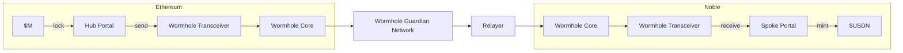

# Architecture

The implementation of USDN is in the [`dollar`](github.com/noble-assets/dollar) module.
It handles all core functionality including rebasing mechanics,
cross-chain operations, and vault management.

The module integrates with external bridging protocols like Wormhole, IBC, and Hyperlane to enable USDN transfers while preserving rewards-bearing properties across different networks.

 ```mermaid
  flowchart TB
    %% Top source
    M0[M0]

    %% x/dollar module
    subgraph CORE ["x/dollar"]
      IDX[Index Update]
      UPS[Update Supply]
      MINT[Mint Yield]
      PRINCIPAL[("Principal")]
      STATS[("Statistics")]

      IDX --> UPS
      UPS -->|yield = Δ supply| MINT
    end

    %% Connections into core
    M0 --> IDX

    %% Distribution
    MINT --> YDE[Yield Distribution Engine]
    YDE --> USER[User Wallets]

    %% Cross-chain section
    subgraph CCY ["Cross-Chain Yield"]
      IBC[IBC]
      HYP[Hyperlane]
    end
    YDE --> CCY
    CCY --> ETH[Ethereum]
    CCY --> ARB[Arbitrum]
    CCY --> COS[Cosmos Chains]

    %% User action back to core
    USER --> |MsgClaimYield| CORE
  ```

## Rebasing Mechanism

USDN automatically rebases when Treasury rewards accrue. The system tracks a global `Index` that increases over time, which grows user balances proportionally. 
The `Index` field is a [`collections.Item`](https://docs.cosmos.network/v0.53/build/packages/collections#item) that stores the current USDN rebasing multiplier `(math.LegacyDec)`.

The index starts at `1.0` and increases as rewards accrue, causing all balances to grow proportionally.

For each address, the protocol tracks two key values:
- **Principal Amount**: The fixed underlying amount (never changes)
- **Present Amount**: What users see in their wallet (grows with rewards)

The rewards distribution flow works as follows:

1. **Index Update**: Noble periodically receives an updated index from M0
2. **Supply Calculation**: New expected supply = `total principal × new index`
3. **Token Minting**: Difference between expected and current supply gets minted
4. **Rewards Distribution**: New tokens flow to the rewards module account, then:
   - **Users on Noble**: Must manually claim their rewards via [`MsgClaimYield`](https://github.com/noble-assets/dollar/blob/main/spec/02_messages.md#claim-yield)
   - **Cross-chain recipients**: Rewards are automatically sent every ~2 hours via configured IBC/Hyperlane routes when index updates occur

### Rewards Distribution Example

**Initial State:**
- User holds: **1,000 USDN**
- User's principal: **1,000** (underlying ownership)
- Current index: **1,000,000,000,000**

**After 5% Treasury Rewards:**
- New index: **1,050,000,000,000** (5% increase)
- New balance = `Principal * (New Index / Old Index)`
- New balance = `1,000 * 1.05 = 1,050 USDN`
- User automatically earns: **50 USDN** (5% rewards)

This 5% index increase makes 5% additional balance claimable per user based on their principal and the new index; balances update upon claim.

## Cross-Chain Operations

USDN enables cross-chain yield streaming functionality in a manner that preserves the token's yield-bearing properties across different blockchain networks.

Both \$M principal and the accrued yield are bridged to Noble from Ethereum via Wormhole's Native Token Transfer (NTT) through M0's [M Portal](https://docs.m0.org/home/technical-documentations/m-portal/overview/). This bridging mechanism locks the original \$M tokens on Ethereum and sends the equivalent value to Noble.



Once the bridged \$M arrives on Noble, it is minted as USDN with the same rebasing properties as the original \$M token.

From Noble, USDN can be further distributed to other blockchain networks via two primary bridging protocols. **IBC (Inter-Blockchain Communication)** enables USDN transfers to Cosmos SDK chains over IBC channels, while **Hyperlane** facilitates movement to EVM-compatible chains.
## Vaults

USDN supports vault functionality that allows users to lock their tokens for additional rewards or benefits beyond the base yield.

### Points Vault

The current vault system focuses on the Points Vault ([Season 2 of the points program](https://www.noble.xyz/blog/noble-usdn-points-next-phase)). Users lock USDN to earn points that will be redeemable for the \$NOBLE token when the [Noble AppLayer](https://www.noble.xyz/blog/noble-applayer) launches. A managed Hyperliquid vault is in the works for additional reward opportunities.

Each vault position is uniquely identified by a combination of user address, vault type, and creation timestamp. During Season 2 of the points program, rewards are redirected to a configured collector address.

## Key Formulas

### Rebasing Formulas

```math
\text{Present Amount} = \text{Principal Amount} \times \text{Index}
```

```math
\text{Principal Amount} = \frac{\text{Present Amount}}{\text{Index}}
```

### Rewards Calculations

```math
\text{Expected Balance} = \text{Principal} \times \text{Current Index}
```

```math
\text{Claimable Rewards} = \text{Expected Balance} - \text{Current Balance}
```

### Index Operations

```math
\text{New Supply} = \text{Total Principal} \times \text{New Index}
```

```math
\text{Rewards Amount} = \text{New Supply} - \text{Current Supply}
```
