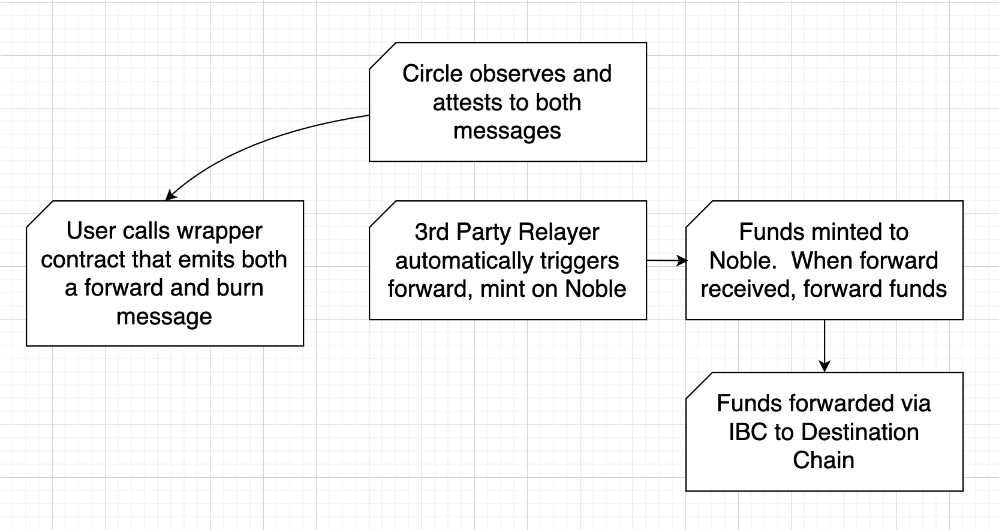

# Noble CCTP

## What is CCTP?

CCTP is Circle's [Cross-Chain Transfer Protocol] which primarily allows users to burn USDC tokens on one chain and mint them on another. It additionally allows general message passing.

The simple transfer flow is the same for every source/destination chain route:

1. User burns funds on source chain
2. A Circle service observes and attests to this message
3. Either the user or a third party relays the message and attestation to the destination chain
4. User receives minted funds on destination chain

## Noble CCTP

Noble's CCTP implementation additionally includes an IBC router implementation for forwarding tokens minted via CCTP to IBC-connected chains.

During the burn, users can include metadata that will trigger an IBC forward after the mint. The burn/mint and forward can be received in any order.

Additionally, the relaying of the forward and burn messages is automated by an off-chain service for certain routes. These relayers view CCTP messages on source chains, look up their respective attestations, and forward these messages to Noble.

The result: Users sign one transaction to receive their funds on any IBC connected chain.

[Cross-Chain Transfer Protocol]: https://developers.circle.com/stablecoin/docs/cctp-getting-started
