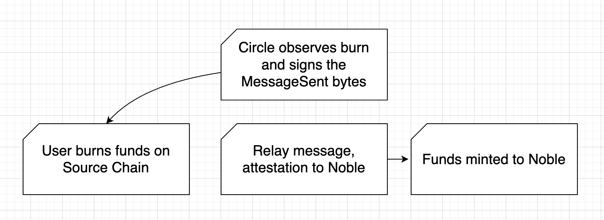

# Noble CCTP

## What is CCTP?

CCTP is Circle's [Cross-Chain Transfer Protocol] which primarily allows users to burn USDC tokens on one chain and mint them on another. It additionally allows general message passing.

The simple transfer flow is the same for every source/destination chain route:

1. User burns funds on source chain
2. A Circle service observes and attests to this message
3. Either the user or a third party relays the message and attestation to the destination chain
4. User receives minted funds on destination chain

[Cross-Chain Transfer Protocol]: https://developers.circle.com/stablecoins/cctp-getting-started
