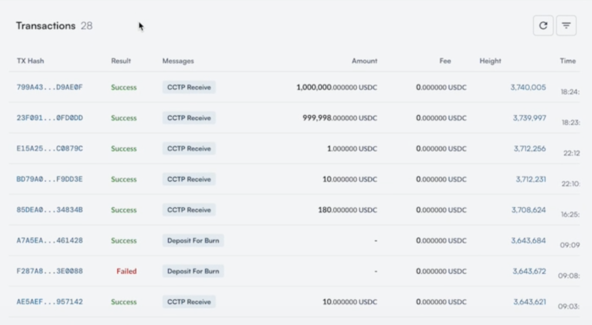
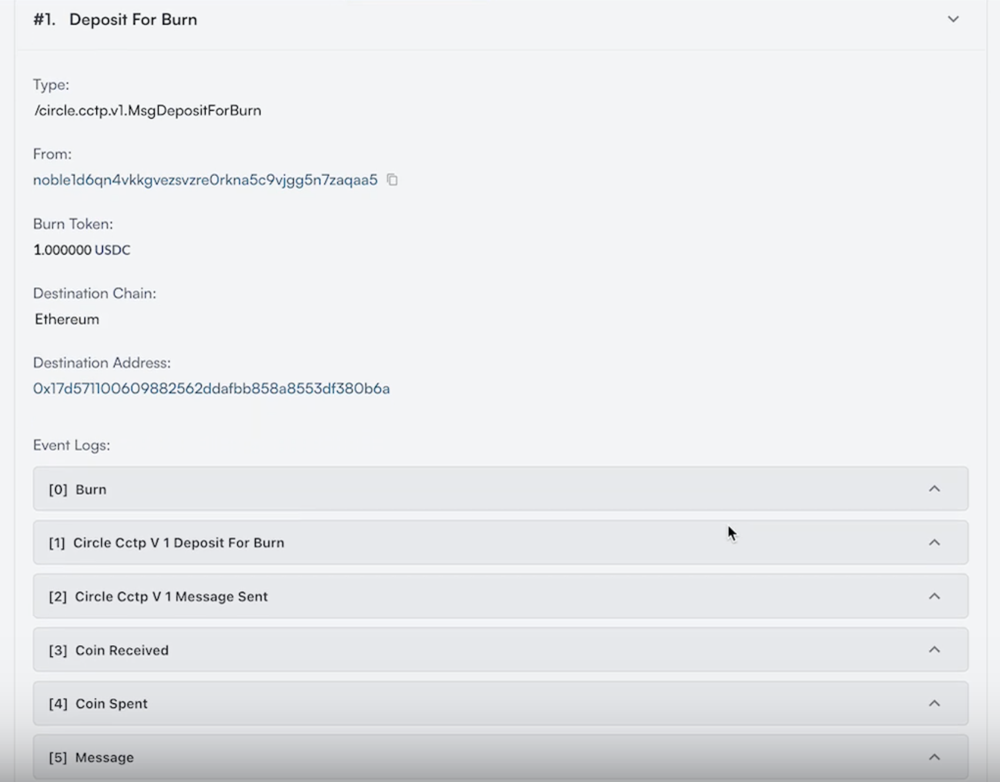
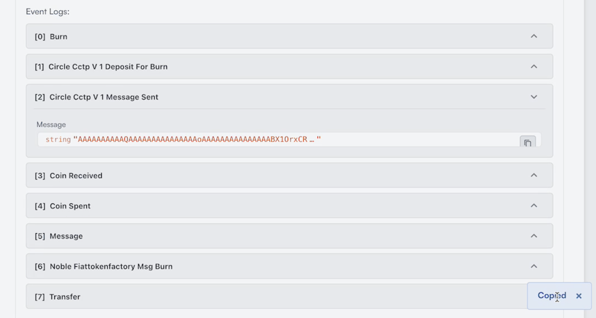
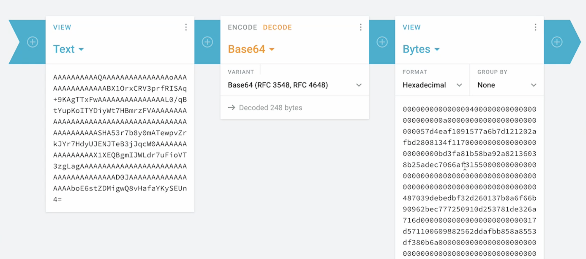
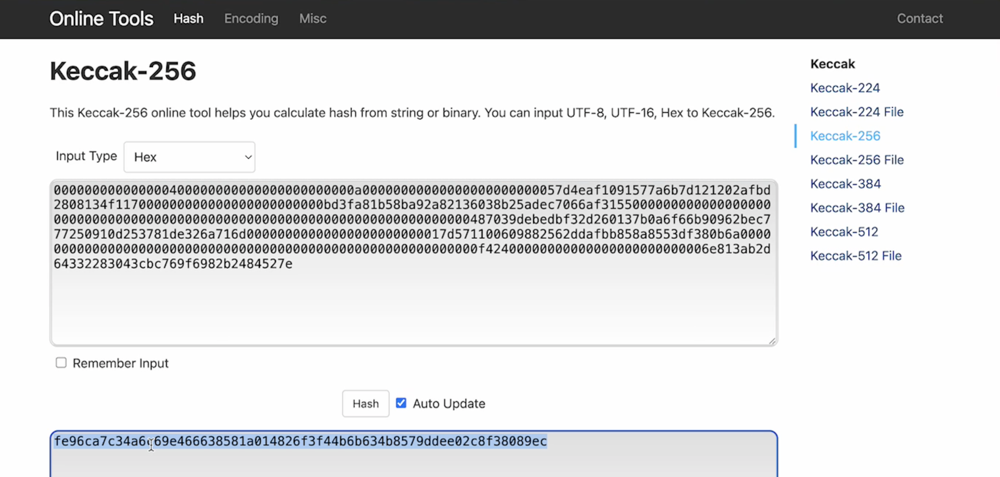
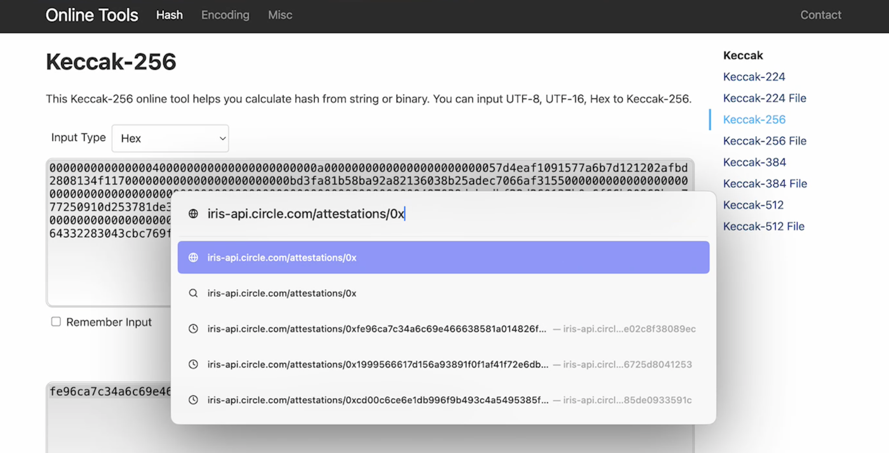
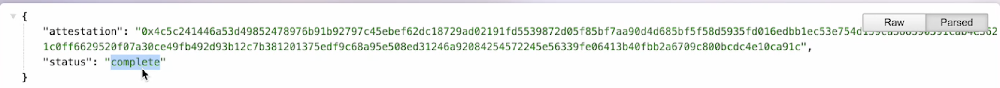
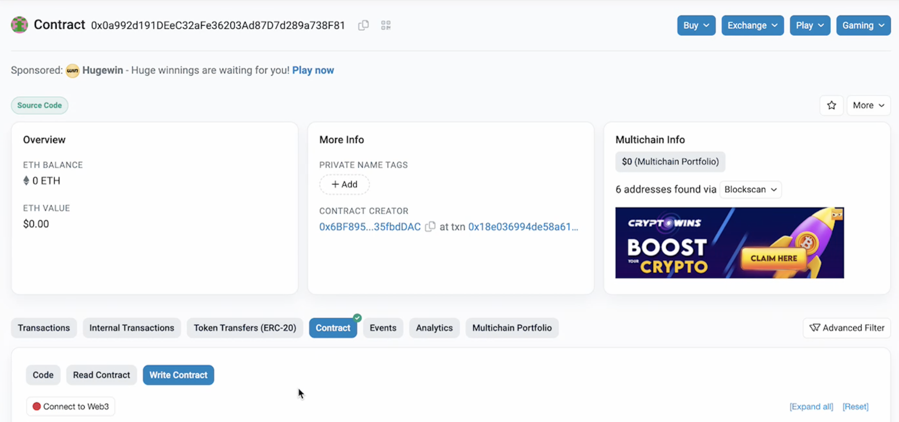
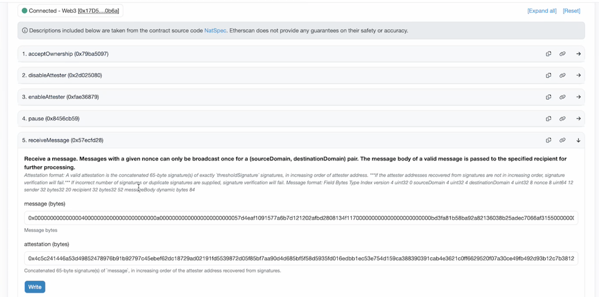

# Manual CCTP Relaying from Noble to Ethereum

CCTP has been integrated to the v4 dYdX chain via withdrawing $USDC (Asset 0) from individual sub accounts and then sending that to Noble via IBC.

Once the $USDC has been transferred back to the Noble chain, the user is then prompted to send a “Deposit For Burn” transaction to transfer these funds onto Ethereum or other CCTP enabled networks.

In the case that the transfer does not come through on the destination chain, there is a way to resolve this individually by manually relaying the transaction!

## Finding “Deposit For Burn” Transactions

Using [Mintscan](https://mintscan.io/noble), you can easily find the user's account. Typically, this transaction should be on the first page of the user's address activity on a block explorer such as Mintscan.

## Inspecting the Transaction 

Once you find the transaction in question, you will want to inspect the event logs of the Deposit for Burn transaction. This is the information you will use to fetch the attestation signature when the transaction was verified by Circle. Look for [2] Circle CCTP V1 Message Sent.  

Next, you will want to expand the event log and copy string for the sent message. This message is emitted by the CCTP module on Noble. Since Noble is a Cosmos chain, and all Cosmos chains encode messages in Base64, this string needs to be decoded to Hex to be compatible with Ethereum. Copy this message. 

## Decoding Base64 to Hex 

Then, take this copied message to an online Base 64 -> Hex decoder. We suggest using: https://cryptii.com/pipes/base64-to-hex 

In the text area, decode to Base64 and paste in the Circle CCTP V1 Message sent. Make sure to remove the quotations from the pasted text. This converts the Base64 message to Hexadecimal bytes and “Group by” None: 

Next step is to take this Hexadecimal bytes output and Keccak256 hash this data as Circle only stores hashes of this data, and not the full message output. You can use this link to hash this data: https://emn178.github.io/online-tools/keccak_256.html 

First, change the input type from UTF-8 to Hex and paste in the bytes. Copy this hash. 

## Fetching attestation from Circle  

With this hash, you can now fetch the attestation. Go to https://iris-api.circle.com/attestations/ and at the end of this address add a 0x and copy the hash and enter this URL into your browser. 

This outputs the attestation which should be marked as “completed” as shown in the image. Copy the attestation. Now you are ready to relay. 

## Manually relaying on Ethereum    

Go to the MessageTransmitter contract on Etherscan. This smart contract is used to send and receive all CCTP transactions. You can find the specific link to the contract for your destination chain from [Circle’s documentation](https://developers.circle.com/stablecoins/docs/evm-smart-contracts#messagetransmitter-mainnet). 

Click on contract, write contract, which will then prompt you to connect to Web3 and connect your wallet. 

When your wallet is connected, go to [5] Receive Message. Here, you will paste your attestation and the decoded hexadecimal bytes into the message field that were previously decoded under step “Decoding Base64 to Hex”. Make sure to add 0x in front of this message. Click “write”. 

From here, you are able to self relay your message by signing the transaction. This will initiate the burn function to send your funds to Noble. Voila!
