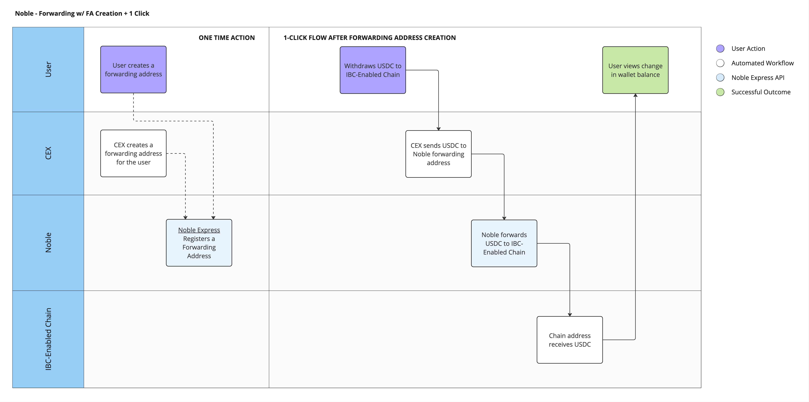

# `x/forwarding` Module

## Background

When [Inter-Blockchain Communication][ibc] (**IBC**) was introduced into Cosmos, it set the standard on how app-chains communicate with each other. IBC is primarily used to facilitate asset transfers between app-chains via ICS-20, the token transfer standard.

However, IBC introduced an UX issue when transferring between multiple networks at once. In order to take your assets from *Chain A* (e.g. Osmosis), through *Chain B* (e.g. Noble), to *Chain C* (e.g. dYdX), this would require 2 separate transactions signed by the user (one on *Chain A* and another on *Chain B*). To address this issue, [Strangelove Labs][strangelove] team developed [Packet Forward Middleware][pfm] (**PFM**), which allows for asynchronous acknowledgements for atomic multi-hop packet flows.

However, this only solves the issue when a user is directly interacting with IBC. With Noble Forwarding and its "intents"-like system, users can use tools like [Circle Mint][mint] and [CCTP][cctp] to receive and transfer assets seamlessly on multiple networks.

## Solution

The `x/forwarding` module works by allowing the permissionless creation of a new account type using the `x/auth` module. This new account type, `ForwardingAccount`, adds two fields to the `BaseAccount`: the *channel id* of an IBC enabled chain connected to Noble, and the *recipient* address on that connected chain.

### Example

```json
{
  "account": {
    "@type": "/noble.forwarding.v1.ForwardingAccount",
    "base_account": {
      "address": "noble1...",
      "pub_key": null,
      "account_number": "0",
      "sequence": "0"
    },
    "channel": "channel-22",
    "recipient": "osmo1...",
    "created_at": "5797500"
  }
}
```

This account has the address `noble1...`, which natively receives $USDC and other tokens. However, the `channel` and `recipient` fields tell the `x/forwarding` module how to automatically forward any tokens that this account receives.

Below is an example of how forwarding may be used to transfer tokens from an exchange to an IBC-connected chain.


## Usage

There are two ways that someone can register a forwarding account on Noble.

### 1. Directly on Noble

You can register a forwarding account by submitting a transaction directly to Noble. This can be done via our CLI:

```shell
nobled tx forwarding register-account [channel] [recipient]
```

#### Fields

*channel*: specifies the IBC channel through which tokens are forwarded

*recipient*: the address that receives the forwarded tokens

### 2. Via an ICS-20 Transfer

You can register a forwarding account by sending an ICS-20 transfer packet to Noble. The packet memo should be formatted as follows:

```json
{
  "noble": {
    "forwarding": {
      "recipient": "cosmos1..."
      // "channel": "channel-0"
    }
  }
}
```

By default, the *channel* is implied from the incoming IBC packet; however, you can manually override this by additionally specifying in the `channel` field.

#### Fields

*channel*: specifies the IBC channel through which tokens are forwarded

*recipient*: the address that receives the forwarded tokens

## Querying Forwarding Information

The x/forwarding module provides several queries that allow you to retrieve information about forwarding accounts, allowed denominations, and overall statistics.

### Get Allowed Denominations

Get the list of denominations currently allowed for forwarding:

```json
nobled query forwarding denoms
```

### Get Forwarding Account Details

Get the details of a specific forwarding account. The response contains the associated channel and recipient:

```json
nobled query forwarding address [channel] [address]
```

#### Fields

*channel*: specifies the IBC channel through which tokens are forwarded

*address*: the address of the forwarding account

### Querying Forwarding Statistics

Get an overview of forwarding statistics. The response contains the number of accounts and the amount forwarded:

```json
nobled query forwarding stats
```

### Querying Statistics by Channel

Retrieve forwarding statistics specific to a particular channel. The response contains the number of accounts and the amount forwarded, specific to that channel.

```json
nobled query forwarding stats [channel]
```

#### Fields

*channel*: specifies the IBC channel to get stats of

[cctp]: https://www.circle.com/en/cross-chain-transfer-protocol
[ibc]: https://www.ibcprotocol.dev/
[mint]: https://www.circle.com/en/circle-mint
[pfm]: https://github.com/cosmos/ibc-apps/tree/main/middleware/packet-forward-middleware
[strangelove]: https://strange.love/
